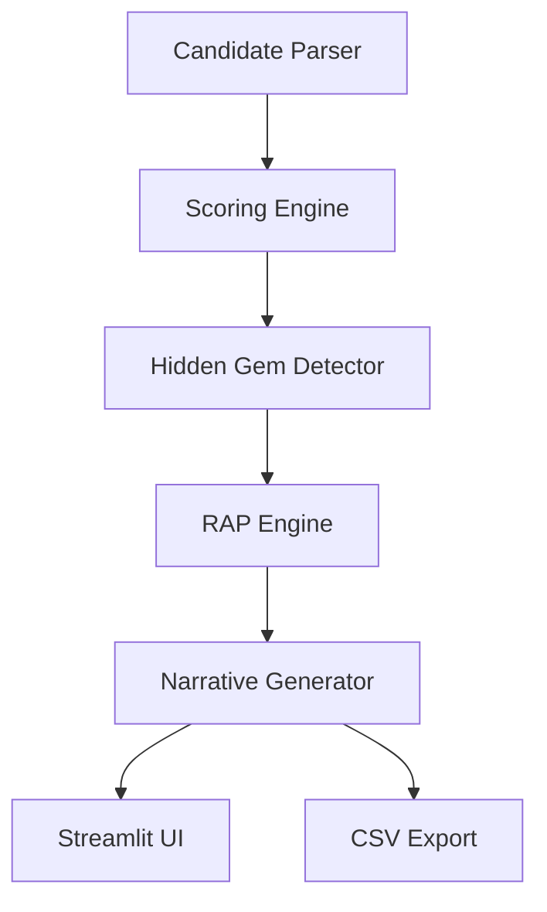
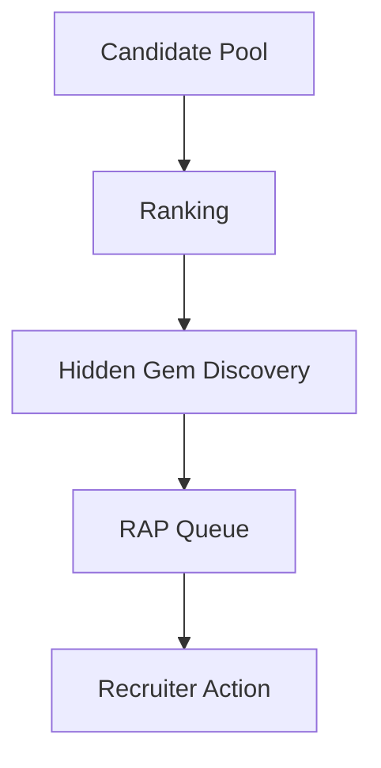
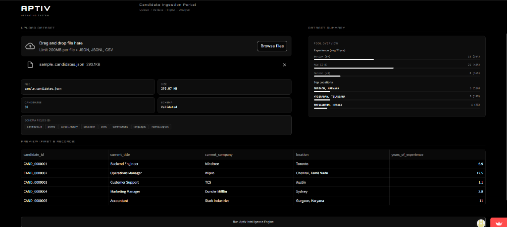
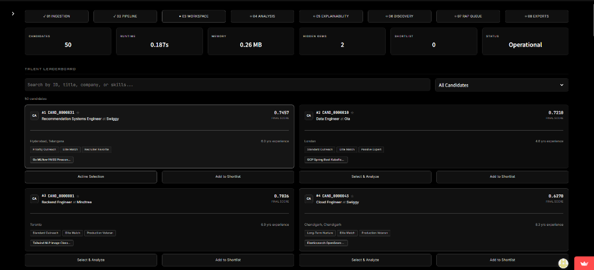
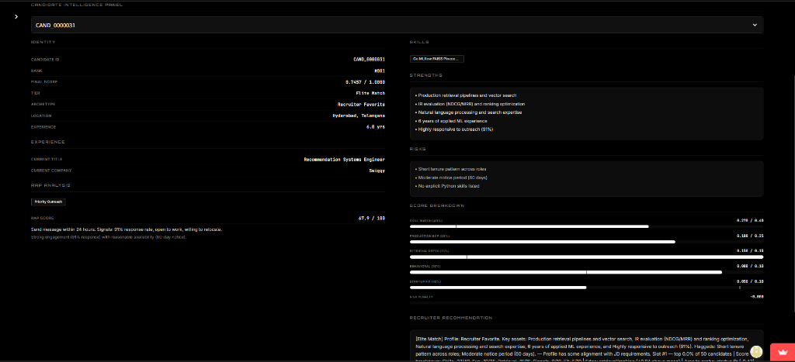
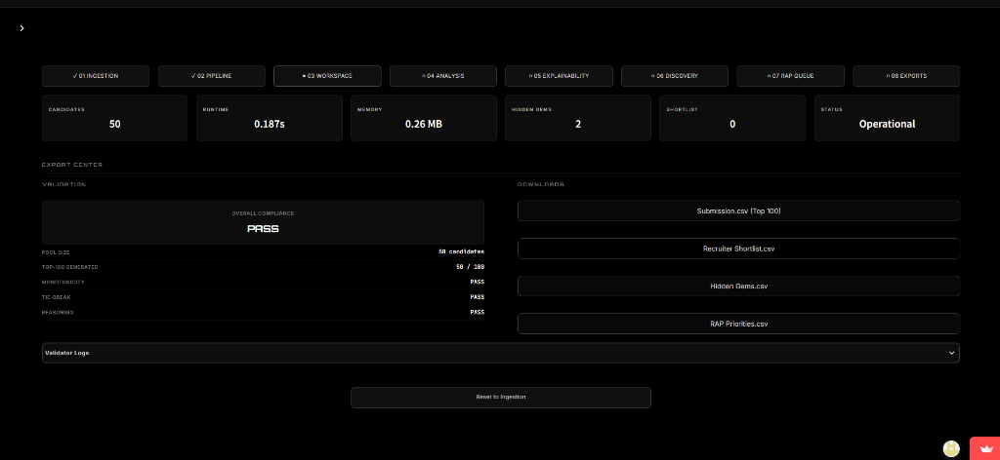

<h1 align="center">APTIV</h1>

<p align="center">
AI-Powered Talent Intelligence Platform
</p>

<p align="center">
<a href="https://aptiv-ranker.streamlit.app">

</a>
</p>

<p align="center">


</p>

---

## Quick Navigation

- [Overview](#overview)
- [Key Features](#key-features)
- [Architecture](#architecture)
- [Pipeline](#pipeline)
- [Technology Stack](#technology-stack)
- [Screenshots](#screenshots)
- [Performance](#performance)
- [Installation](#installation)
- [Deployment](#deployment)
- [Roadmap](#roadmap)
- [License](#license)

---

## Overview

Aptiv is a production-grade Talent Intelligence Platform designed to rank, explain, and prioritize large-scale candidate pools. Traditional Applicant Tracking Systems (ATS) rely heavily on simplistic keyword filters, resulting in missed capability, hidden talent bias, and a lack of transparency. 

Aptiv redefines this workflow through:
- **Talent Intelligence**: Multidimensional profile scoring rather than keyword matching.
- **Candidate Ranking**: Deterministic, weighted evaluation of skills, experience, domain depth, and behavior.
- **Hidden Talent Discovery**: Identifying high-potential, passive, or underexposed talent.
- **Recruiter Prioritization**: Urgent action scoring based on response rates, availability, and engagement.
- **Explainability**: Rich, deterministic, template-driven briefings that outline strengths, risks, and next steps.

<div align="center">

### Aptiv vs. Traditional ATS

| Capability | Traditional ATS | Aptiv |
| :--- | :--- | :--- |
| **Ranking Method** | Keyword count / overlap score | 5-component weighted scoring across skills, experience, depth, behavior, and startup fit |
| **Hidden Talent Detection** | None | 6-component Hidden Gem engine with 5 candidate categories |
| **Recruiter Prioritization** | None — all ranked equally | RAP engine with urgency scoring and action instructions |
| **Explainability** | None or raw keyword scores | Deterministic, template-driven recruiter briefings |
| **Honeypot/Risk Detection** | None | Automated detection of timeline inconsistencies, inflated skills, and title mismatches |
| **Dependencies** | Opaque third-party APIs / LLMs / GPUs | Lightweight, CPU-only, fully offline parsing and evaluation |

</div>

---

## Key Highlights

- 100K Candidate Processing
- Hidden Talent Discovery
- Recruiter Action Prioritization
- Explainable Rankings
- Deterministic Scoring
- Interactive Sandbox
- Public Deployment
- Offline Processing

---

## Key Features

### Ranking Engine
- **Problem**: Keyword matching in traditional ATS rewards buzzword density over actual engineering competence and track record.
- **Approach**: Evaluates candidate profiles on 5 key weighted metrics (Skill Match, Production Experience, Retrieval/Ranking Depth, Behavioral Signals, and Startup Fit) and penalizes for timeline, salary, or profile trust risks.
- **Output**: A normalized candidate score between 0.0 and 1.0.
- **Business Value**: Automatically discovers candidates who have the core engineering skills even if their resumes use alternative terminology.

### Hidden Gem Detection
- **Problem**: Outstanding candidates with non-traditional paths, high growth rates, or low platform visibility are often buried in deep backlogs.
- **Approach**: Calculates a Hidden Gem index (0-100) based on Behavioral Excellence (30%), Skill Adjacency (20%), Technical Evidence (20%), Growth Trajectory (15%), Market Demand (10%), and Recruitability (5%).
- **Output**: Categorization into one of 5 distinct groups (Emerging Specialist, Growth Candidate, High Intent Candidate, Underexposed Expert, or Startup Builder) alongside recruiter insights.
- **Business Value**: Unlocks a pipeline of competitive, high-quality, and motivated candidates that traditional platforms miss.

### RAP Engine
- **Problem**: A high-ranking candidate who is unreachable or has a long notice period slows down recruiter workflows.
- **Approach**: Analyzes candidate engagement velocity, availability (open-to-work status, notice periods), conversion likelihood, and match baseline score.
- **Output**: A RAP score (0-100) mapped to outreach priority tiers and specific call-to-actions.
- **Business Value**: Speeds up candidate contact-to-hire times by prioritizing highly responsive talent.

### Explainability
- **Problem**: Recruiters cannot defend AI-generated candidate ranks to hiring managers without auditability and clear reasoning.
- **Approach**: Compares candidate sub-scores and behavioral data directly against the average of the candidate pool.
- **Output**: Percentile performance breakdowns, strength details, and risk flags.
- **Business Value**: Eliminates the "black box" concern, building recruiter and manager trust in recommendations.

### Narrative Intelligence
- **Problem**: Recruiter time is wasted opening and scanning resumes to understand candidate context.
- **Approach**: Selects from 10 professional archetypes and 8 narrative templates using deterministic, hash-varied sentence construction to build briefings.
- **Output**: A concise, tailored recruiter summary summarizing candidate background, strengths, concerns, and next-step actions.
- **Business Value**: Accelerates shortlist review speeds by 10x by replacing resume skimming with scannable candidate bios.

### Sandbox Platform
- **Problem**: Programmatic pipelines are hard to interactively test, audit, and demo.
- **Approach**: Web interface with dark theme and reactive UI components.
- **Output**: Interactive tables, dashboards, and exportable CSVs for analysis.
- **Business Value**: Enables non-technical hiring managers to immediately search, compare, and validate candidate data.

---

## Technical Specifications

<div align="center">

### Scoring Calculations

| Metric | Weight | Key Signals |
| :--- | :--- | :--- |
| **Skill Match** | 0.40 | JD alignment (e.g. Python, Vector DBs, embeddings, NLP, distributed systems) |
| **Production Experience** | 0.25 | System track record, Years of Experience capped at 8 (penalties for pure research or consulting) |
| **Retrieval / Ranking** | 0.15 | Dense retrieval, vector databases, search infrastructure |
| **Behavioral Score** | 0.10 | Response rates, interview rates, platform activity recency, and availability |
| **Startup Fit** | 0.10 | Small-team compatibility (penalties for corporate title chasing) |

</div>

#### Risk Penalties
- **Chronology / Timeline Inconsistencies**: -0.30
- **Salary Mismatch / Out of Range**: -0.30
- **Data Quality / Trust Flags**: -0.20
- **Honeypot: Title to Experience Mismatches**: -0.30
- **Honeypot: Inflated Career Timelines**: -0.30
- **Honeypot: Unrealistic Skill Breadth**: -0.30

---

<div align="center">

### Hidden Gem Classification

| Category | Sourcing Focus | Candidate Indicators |
| :--- | :--- | :--- |
| **Emerging Specialist** | Competent but low keyword density | Strong assessment results with few JD matches |
| **Growth Candidate** | Coachable, high-ceiling talent | 2-5 YoE with high engagement and startup alignment |
| **High Intent Candidate** | Ready to hire, low friction | Open-to-work status, high response rate, login activity |
| **Underexposed Expert** | Overlooked technical talent | Good skill match and GitHub activity with low platform views |
| **Startup Builder** | Full-stack ownership mindset | Startup fit alignment, distributed systems background, GitHub activity |

</div>

---

<div align="center">

### RAP Urgency Categories

| Score Range | Urgency Tier | Call to Action |
| :--- | :--- | :--- |
| **>= 80** | Contact Immediately | Outreach within 24 hours |
| **65 - 79** | Priority Outreach | Schedule screening interview this week |
| **45 - 64** | Standard Outreach | Queue for active talent pipeline |
| **25 - 44** | Long-Term Nurture | Track candidate for re-engagement |
| **< 25** | Do Not Prioritize | Deprioritize in favor of high-ROI prospects |

</div>

---

## Architecture

Aptiv uses a modular structure where each component has a clear input/output contract:

<div align="center">

| Module | Responsibility | Input | Output |
| :--- | :--- | :--- | :--- |
| **candidate_parser.py** | Parser and feature extractor | Raw candidate profiles | DataFrame with extracted features |
| **scorer.py** | Weighted composite scoring | Parsed DataFrame | Scoring metrics and final score [0.0, 1.0] |
| **hidden_gem_detector.py** | Undervalued candidate detector | Scored DataFrame | Hidden Gem category and score |
| **rap_engine.py** | Prioritization and outreach queue | Enriched DataFrame | RAP score, urgency tier, and action guidance |
| **narrative_generator.py** | Explainability text generator | Enriched DataFrame | Archetype tags and candidate narrative briefings |
| **generate_submission.py** | Batch CLI pipeline orchestrator | Data file paths | Exported ranking output CSV |
| **app.py** | Interactive Streamlit sandbox | User file upload or demo data | Interactive web dashboard and visual tools |

</div>

### System Architecture Diagram



---

## Pipeline

The candidate ingestion and evaluation pipeline operates sequentially across nine stages.

### Pipeline Flow

```mermaid
graph LR
    Dataset_Upload[Dataset Upload] --> Parsing[Parsing]
    Parsing --> Feature_Extraction[Feature Extraction]
    Feature_Extraction --> Scoring[Scoring]
    Scoring --> Hidden_Gem_Detection[Hidden Gem Detection]
    Hidden_Gem_Detection --> RAP_Prioritization[RAP Prioritization]
    RAP_Prioritization --> Narrative_Generation[Narrative Generation]
    Narrative_Generation --> Leaderboard[Leaderboard]
    Leaderboard --> Export[Export]
```



### Recruiter Workflow



---

## Technology Stack

<div align="center">

| Layer | Technology | Logo / Badge | Why This Choice |
| :--- | :--- | :--- | :--- |
| **Frontend** | Streamlit 1.42 |  | Interactive dashboards with zero frontend boilerplate. Native dark theme. |
| **Backend** | Python 3.10+ |  | Industry-standard language with rich ecosystem for numerical computation. |
| **Data Processing** | Pandas & NumPy |   | Vectorized operations across 100K candidates — no row-level loops. |
| **Deployment** | Streamlit Cloud |  | Zero-config deployment with public URL. Fully managed cloud service. |
| **Version Control** | Git + GitHub |  | Standard collaborative development with full commit history. |

</div>

---

## Screenshots

### Dataset Upload

Upload candidate data via drag-and-drop. Supports JSON, JSONL, and CSV formats. Includes pool overview with experience distribution, location breakdown, and schema validation.

<p align="center">
  
</p>

---

### Talent Leaderboard

Top candidates ranked by composite score. Each card shows rank, final score, archetype tags (Elite Match, Recruiter Favorite, Production Veteran), and quick-action buttons for analysis and shortlisting.

<p align="center">
  
</p>

---

### Candidate Analysis

Deep-dive intelligence panel for any candidate. Includes identity, experience, RAP analysis, skill tags, strengths, risks, full score breakdown with weighted sub-scores, and recruiter recommendation narrative.

<p align="center">
  
</p>

---

### Export Center

Export center with one-click CSV downloads (Submission, Recruiter Shortlist, Hidden Gems, RAP Priorities). Includes built-in validation panel showing compliance status for pool size, monotonicity, tie-breaking, and reasoning quality.

<p align="center">
  
</p>

---

## Performance

Tested on a 4-core CPU, 16 GB RAM, Windows 10 — no GPU, no network dependencies, and no external API calls.

<div align="center">

| Metric | Result |
| :--- | :--- |
| **Total Pipeline Runtime** | ~199 seconds |
| **Peak Memory Usage** | ~205 MB |
| **Candidates Processed** | 100,000 |
| **Execution Model** | CPU Only |
| **Network Requirements** | None |
| **Acceleration Needed** | None (No GPU / No APIs) |

</div>

---

## Repository Structure

```
Aptiv/
├── app.py                          # Streamlit sandbox web application
├── candidate_parser.py             # Feature extraction and parser engine
├── scorer.py                       # Multi-factor candidate scoring model
├── hidden_gem_detector.py          # Sourcing engine for high-potential candidates
├── rap_engine.py                   # Recruiter Action Prioritization
├── narrative_generator.py          # Deterministic explainability text generator
├── generate_submission.py          # CLI command-line runner for batch execution
├── requirements.txt                # Production dependencies
├── LICENSE                         # MIT License
├── assets/
│   └── screenshots/                # Application UI screenshots
└── data/
    ├── sample_candidates.json      # 50-candidate demonstration dataset
    └── candidates.jsonl            # Main 100K candidate database (gitignored)
```

---

## Installation

### Prerequisites
- Python 3.10+
- No GPU or external API keys required.

### Setup
```bash
# Clone the repository
git clone https://github.com/asc006-git/Aptiv.git
cd Aptiv

# Install dependencies
pip install -r requirements.txt
```

### Run the Sandbox Local Server
```bash
python -m streamlit run app.py
```

### Generate Batch Results
```bash
# Process full 100,000 candidate dataset
python generate_submission.py --input data/candidates.jsonl --output submission.csv

# Process sample 50 candidate dataset
python generate_submission.py
```

---

## Deployment

Aptiv is deployed as a public serverless application using Streamlit Cloud. 

- **Repository**: Connected directly to the GitHub repository.
- **Runtime Environment**: Installs standard packages listed in `requirements.txt`.
- **Main Script**: Serves the dashboard directly via `app.py`.

---

## Roadmap

<div align="center">

| Version | Phase | Description |
| :--- | :--- | :--- |
| **v2.0** | ATS Integrations | Direct integration with Greenhouse, Lever, and Ashby APIs |
| **v2.1** | Talent Graph | Relational maps between candidates based on shared networks |
| **v3.0** | Hybrid LLM Assistance | Optional generative narrative styling layered over deterministic scoring |
| **v4.0** | Streaming Architecture | Real-time candidate evaluation for databases over 1M records |

</div>

---

## License

This project is licensed under the MIT License — see the [LICENSE](LICENSE) file for details.

You are free to use, modify, and distribute this software for any purpose, including commercial applications, subject to the terms of the MIT License.
